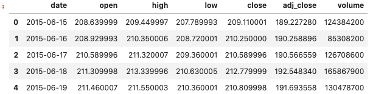
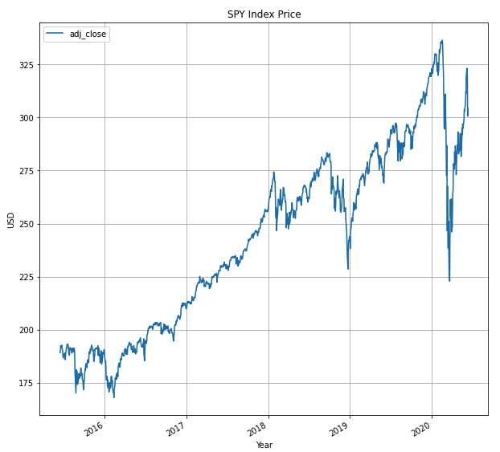
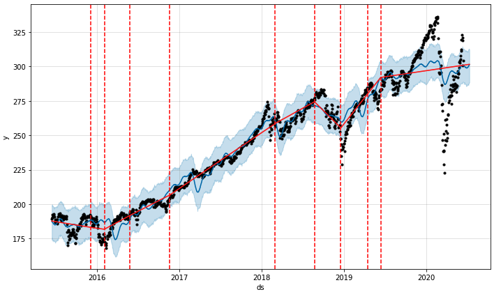
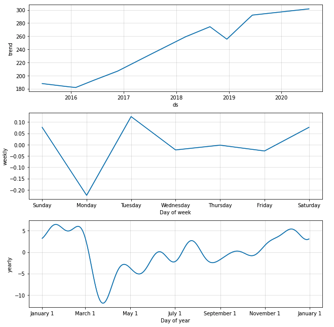
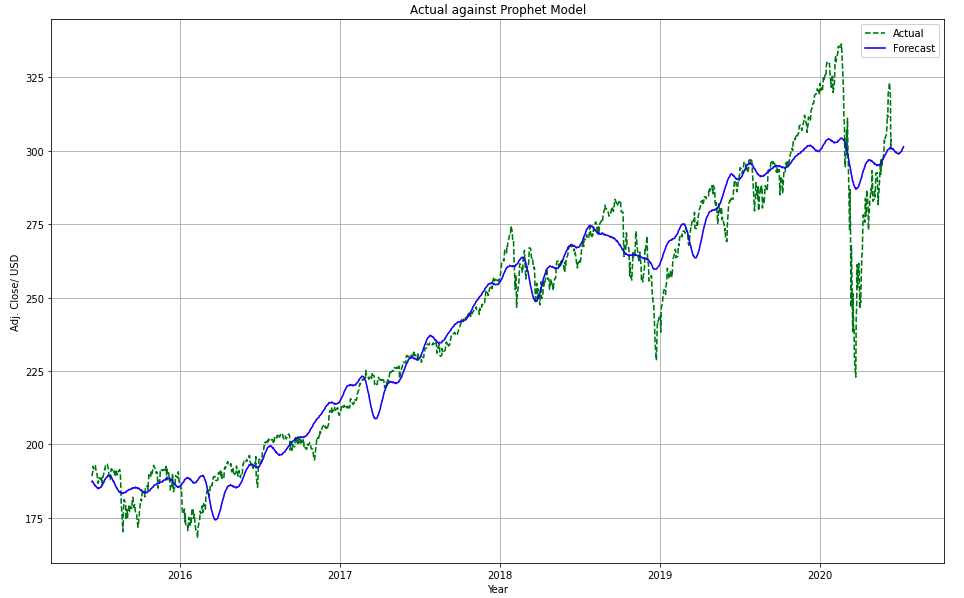

# FB Prophet ETF Forecasting
 Forecasting ETF performance with Facebook Prophet

## Forecasting ETF prices
The aim of this project was to utilize Facebook's open source Prophet forecasting model to predict future prices of [State Street's S&P 500 ETF](https://finance.yahoo.com/quote/SPY/). With publicly available data on Yahoo Finance, it was relatively easy to get five year's worth of ETF prices.

The next step was to implement [Facebook's Prophet forecasting model](https://facebook.github.io/prophet/), which is effective and relatively simple to use. It is a robust model that works best well with historical data. Moreover, it's tuning parameters allow for adjustment and increases in accuracy, subjected to various configurations. The Facebook team highlights 2 of Prophet's main advantages:

### 1. Easy to produce straightforward, resonable and accurate forecasts
### 2. Prophet forecasts are customizable in ways that are intuitive to non-experts.

More can be found at this [link here](https://research.fb.com/blog/2017/02/prophet-forecasting-at-scale/)

## Introduction to Prophet
In summary, Prophet is an additive regression model that shines through its ease of use for analyst-in-the-loop forecasts and has worked well for many business forecasts tasks that were encountered at Facebook. It has four main components, namely:

- Uses a piecewise linear or logisitc growth curve trend, where Prophet automatically detects changes in trends by selecing changepoints from the data.
- Incorporates a yearly seasonal component modeled using Fourier series.
- Weekly seasonal component using dummy variables.
- User provided list of important holidays.

### Getting the data
Yahoon Finance provides historical data for free, which you can obtain [here](https://finance.yahoo.com/quote/SPY/history?p=SPY).

```python
# reading the dataset
# 5 years worth of pricing data
df = pd.read_csv('SPY.csv')

# convert Date column to datetime
df.loc[:, 'Date'] = pd.to_datetime(df['Date'], format = '%Y-%m-%d')

# remove spaces in col headers
df.columns = [str(i).lower().replace(' ','_') for i in df.columns]

# sort values by datetime
df.sort_values(by = 'date', inplace = True, ascending = True)

df.head()
```


In this dataset, it has pricing data ranging from 15/6/15 - 12/6/20. We can plot a graph to understand the adjusted closing price over time.
```python
# Plot adjusted closing price of ETF over time
plt = df.plot(x = 'date', y = 'adj_close', linestyle='-', figsize = [10,10], grid = True)
plt.set_title('SPY Index Price')
plt.set_xlabel('Year')
plt.set_ylabel('USD')
```


### Preparing the data for Prophet
Prophet always takes in a dataframe with 2 columns, ```ds``` (datestamp) & ```y``` (must be numeric), where y is the measurement we want to forecast.
```python
# Create new dataframe for Prophet
# Prophet always takes in 2 columns only, DS & Y
df_prophet = df[['date', 'adj_close']].rename(columns = {'date':'ds', 'adj_close':'y'})
df_prophet.head()
```


For this project, we want to predict 30 days into the future, from our last available pricing date.

*Let H = 30, where H is our forecast horizon.* 

Using this, we will fit the data into the Prophet model.
```python
# Fitting Prophet model
m = Prophet()
m.fit(df_prophet)
```

Next, create a future dataframe with the forecast horizon.
```python
future = m.make_future_dataframe(periods = H)
```

To make the model more accurate, we should account for weekends and remove them from the model, since they are non-trading days and would not be relevant to future forecasts. More on this can be found [here}(https://facebook.github.io/prophet/docs/non-daily_data.html)
```python
future['day'] = future['ds'].dt.weekday
future = future[future['day'] <5]

forecast = m.predict(future)
```
```python
# double check if we have values for future predictions
forecast[['ds', 'yhat', 'yhat_lower', 'yhat_upper']].tail()
```
[Future forecast dataframe](images/Prophet_future_predictions.png)

With everything in place, lets plot the forecast of the Prophet model. In the plot below, significant changepoints have been factored into the graph to provide an understanding of where the series changes, as shown below.
```python
# plot the forecast
from fbprophet.plot import add_changepoints_to_plot
fig = m.plot(forecast);

# add changepoints
a = add_changepoints_to_plot(fig.gca(), m, forecast)
```



```python
# plot components
m.plot_components(forecast);
```
We can take a look at the components of the forecast as well.


Next, I plotted the actual performance of the index against our Prophet model, just to visualize how accurate the automated Prophet model was when compared to actual historical data.

```python
# Plotting the acutal plot against the forecast
plt.rcParams["figure.figsize"] = [16,10]
fig, ax = plt.subplots()
ax.plot('date','adj_close', linestyle='--', color='g', data = df)
ax.plot('ds', 'yhat', linestyle='-', color='b', data = forecast)

ax.set_title('Actual against Prophet Model')
ax.legend(['Actual','Forecast'])
ax.xaxis.set_label_text('Year')
ax.yaxis.set_label_text('Adj. Close/ USD')
ax.grid(True)
plt.show()
```

