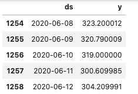

# FB Prophet ETF Forecasting
 Forecasting ETF performance with Facebook Prophet

## Forecasting ETF prices
The aim of this project was to utilize Facebook's open source Prophet forecasting model to predict future prices of [State Street's S&P 500 ETF](https://finance.yahoo.com/quote/SPY/). With publicly available data on Yahoo Finance, it was relatively easy to get five year's worth of ETF prices.

The next step was to implement [Facebook's Prophet forecasting model](https://facebook.github.io/prophet/), which is effective and relatively simple to use. It is a robust model that works best well with historical data. Moreover, it's tuning parameters allow for adjustment and increases in accuracy, subjected to various configurations. The Facebook team highlights 2 of Prophet's main advantages:

### 1. Easy to produce straightforward, resonable and accurate forecasts
### 2. Prophet forecasts are customizable in ways that are intuitive to non-experts.

More can be found at this [link here](https://research.fb.com/blog/2017/02/prophet-forecasting-at-scale/)

## Introduction to Prophet
In summary, Prophet is an additive regression model that shines through its ease of use for analyst-in-the-loop forecasts and has worked well for many business forecasts tasks that were encountered at Facebook. It has four main components, namely:

- Uses a piecewise linear or logisitc growth curve trend, where Prophet automatically detects changes in trends by selecing changepoints from the data.
- Incorporates a yearly seasonal component modeled using Fourier series.
- Weekly seasonal component using dummy variables.
- User provided list of important holidays.

### Getting the data
Yahoo Finance provides historical data for free, which you can obtain [here](https://finance.yahoo.com/quote/SPY/history?p=SPY).

```python
# reading the dataset
# 5 years worth of pricing data
df = pd.read_csv('SPY.csv')

# convert Date column to datetime
df.loc[:, 'Date'] = pd.to_datetime(df['Date'], format = '%Y-%m-%d')

# remove spaces in col headers
df.columns = [str(i).lower().replace(' ','_') for i in df.columns]

# sort values by datetime
df.sort_values(by = 'date', inplace = True, ascending = True)

df.head()
```


In this dataset, it has pricing data ranging from 15/6/15 - 12/6/20. We can plot a graph to understand the adjusted closing price over time.
```python
# Plot adjusted closing price of ETF over time
plt = df.plot(x = 'date', y = 'adj_close', linestyle='-', figsize = [10,10], grid = True)
plt.set_title('SPY Index Price')
plt.set_xlabel('Year')
plt.set_ylabel('USD')
```


### Preparing the data for Prophet
Prophet always takes in a dataframe with 2 columns, ```ds``` (datestamp) & ```y``` (must be numeric), where y is the measurement we want to forecast.
```python
# Create new dataframe for Prophet
# Prophet always takes in 2 columns only, DS & Y
df_prophet = df[['date', 'adj_close']].rename(columns = {'date':'ds', 'adj_close':'y'})
df_prophet.head()
```


For this project, we want to predict 30 days into the future, from our last available pricing date.

*Let H = 30, where H is our forecast horizon.* 

Using this, we will fit the data into the Prophet model.
```python
# Fitting Prophet model
m = Prophet()
m.fit(df_prophet)
```

Next, create a future dataframe with the forecast horizon.
```python
future = m.make_future_dataframe(periods = H)
```

To make the model more accurate, we should account for weekends and remove them from the model, since they are non-trading days and would not be relevant to future forecasts. More on this can be found [here}(https://facebook.github.io/prophet/docs/non-daily_data.html)
```python
future['day'] = future['ds'].dt.weekday
future = future[future['day'] <5]

forecast = m.predict(future)
```
```python
# double check if we have values for future predictions
forecast[['ds', 'yhat', 'yhat_lower', 'yhat_upper']].tail()
```
[Future forecast dataframe](images/Prophet_future_predictions.png)

With everything in place, lets plot the forecast of the Prophet model. In the plot below, significant changepoints have been factored into the graph to provide an understanding of where the series changes, as shown below.
```python
# plot the forecast
from fbprophet.plot import add_changepoints_to_plot
fig = m.plot(forecast);

# add changepoints
a = add_changepoints_to_plot(fig.gca(), m, forecast)
```


```python
# plot components
m.plot_components(forecast);
```
We can take a look at the components of the forecast as well.


Next, I plotted the actual performance of the index against our Prophet model, just to visualize how accurate the automated Prophet model was when compared to actual historical data.

```python
# Plotting the acutal plot against the forecast
plt.rcParams["figure.figsize"] = [16,10]
fig, ax = plt.subplots()
ax.plot('date','adj_close', linestyle='--', color='g', data = df)
ax.plot('ds', 'yhat', linestyle='-', color='b', data = forecast)

ax.set_title('Actual against Prophet Model')
ax.legend(['Actual','Forecast'])
ax.xaxis.set_label_text('Year')
ax.yaxis.set_label_text('Adj. Close/ USD')
ax.grid(True)
plt.show()
```


### Fine tuning the model
Before tuning the model, it is important to understand the significance of the various parameters that Prophet allows for tuning. In my model, I specified the number of changepoints, their scales, mode of seasonality and fourier order.

- *Changepoints* are points in the data where there are sudden changes in trend. It represents a point in time where a significant change occured in the time series.
- *changepoint_prior_scale* is also there to indicate how flexible the changepoints are allowed to be. This is basciallly how much each changepoint is allowed to fit the data. 
- *seasonality_mode* refers to how seasonality components should be integrated with the predictions. There are 2 possible options here, with the default value set to an additive model and multiplicative as the other. In this case, I used an additive model, since we do not expect the behaviour and growth of ETF prices to be significantly different from previous years, so seasonality should be 'constant' over the entire period.
- The Prophet model also allows you to change the *fourier_order*, which represents how sensitive the model will be in fitting quickly-changing and complex seasonality patterns.  

For this model, I used the ParameterGrid function from the Scikit Learn package to create multiple parameter configurations.
```python
# Count the total possible models that can arrive from the various model tuning parameters
# Parameters such as mode of seasonality, fourier order, the number of changepoints and their scale

from sklearn.model_selection import ParameterGrid
params_grid = {'fourier_order':[10,12,15,17,20],
               'changepoint_prior_scale':[0.05, 0.1, 0.5, 1, 1.5, 2],
              'n_changepoints' : [100,150,200]}
grid = ParameterGrid(params_grid)
count = 0
for p in grid:
    count = count+1

print('Total Possible Models',count)
```


To evaluate the various parameters and their error metrics, I collected the error metrics into a separate model_parameters dataframe, before running all configurations.

```python
# Prophet model tuning
model_parameters = pd.DataFrame(columns = ['MAPE', 'MAE', 'RMSE', 'Parameters'])

start = time.time()
counter = 0

for p in tqdm(grid):
    random.seed(10)
    m = Prophet(seasonality_mode = 'additive',
                          changepoint_prior_scale = p['changepoint_prior_scale'],
                          n_changepoints = p['n_changepoints'],
                          daily_seasonality = True,
                          weekly_seasonality = True,
                          yearly_seasonality = True, 
                          interval_width = 0.95)
    
    #iterate through fourier_order
    m.add_seasonality(name='monthly', period=H, fourier_order= int(p['fourier_order']))
                
    # fit our Prophet-ready dataframe
    m.fit(df_prophet)
    future = m.make_future_dataframe(periods = H)
    
    # remove weekends from our dataframe
    future['day'] = future['ds'].dt.weekday
    future = future[future['day'] <5]
    forecast = m.predict(future)
    
    # compute error metrics
    MAPE = get_mape(df['adj_close'], forecast['yhat'][:-20])
    MAE = get_mae(df['adj_close'], forecast['yhat'][:-20])
    RMSE = get_rmse(df['adj_close'], forecast['yhat'][:-20])
    
    # increase counter
    counter +=1    
    model_parameters = model_parameters.append({'MAPE':MAPE, 'MAE':MAE, 'RMSE':RMSE, 'Parameters':p}, 
                                               ignore_index=True)
    
end = time.time()
print("Time taken:" + end-start)
```

We then export the error metrics dataframe to find the optimal configuration which gives us the lowest error metrics. 

```python
# Export results to CSV
model_parameters.to_csv('tuning_results.csv')

# Sort parameters by descending MAPE
model_parameters.sort_values(by = ['MAPE', 'MAE', 'RMSE'])

# Model 79 provides the best results
#grid[79]
```

The next step is to run the final model with our chosen parameters, before fitting it to a prophet model and view the results. In this case, configuration 79 gave us the lowest error metrics.


With this configuration, we can fit our final Prophet model with the chosen parameters to be used for our forecast.

```python
# Train final model with parameters
final_model = Prophet(seasonality_mode='additive', n_changepoints= 150, changepoint_prior_scale = 2)
final_model.add_seasonality(name='monthly', period=H, fourier_order= 12)

# Fit final model
final_model.fit(df_prophet)
future = final_model.make_future_dataframe(periods = H)

# remove weekends
future['day'] = future['ds'].dt.weekday
future = future[future['day'] <5]
forecast_final = final_model.predict(future)
forecast_final.head()
```

Last but not least, we can plot our final graphs to compare them against the actual and forecasted data from our final Prophet model.

```python
# plot graphs
fig2 = final_model.plot(forecast_final);

# with changepoints
a = add_changepoints_to_plot(fig2.gca(), m, forecast_final)
```


```python
# plot components
final_model.plot_components(forecast_final);
```


```python
# plotting final model against actual data
plt.rcParams["figure.figsize"] = [16,10]
fig, ax = plt.subplots()
ax.plot('date','adj_close', linestyle='--', color='g', data = df)
ax.plot('ds', 'yhat', linestyle = '-', color='b', data = forecast_final)

ax.set_title('Actual against Forecast')
ax.legend(['Actual','Forecast'])
ax.xaxis.set_label_text('Year')
ax.yaxis.set_label_text('Adj. Close/ USD')
ax.grid(True)
plt.show()
```


Finally, we can view the forecast for the ETF prices with the forecast horizon. 

```python
start_dt = '2020-06-15'
forecasts= forecast_final[(forecast_final.ds >= start_dt)]
forecasts.yhat
```

